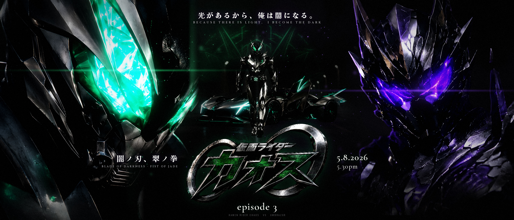
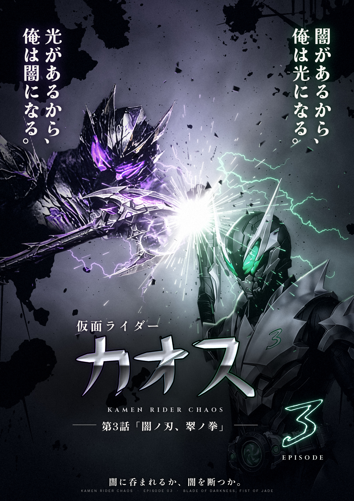

# Kamen Rider Chaos, Episode 3: 「闇ノ刃、翠ノ拳」

This folder has two key-art pieces for episode 3.

## 21:9 key art (`banner-21x9.png`, 3360×1440)

A high-contrast, dark-theme widescreen banner that follows the series look set by the episode 1 poster:

- **The face-off:** the Kamen Rider Chaos helmet fills the left side and Umbrazor fills the right. Each giant is rim-lit by the light between them, and their eye glows throw anamorphic flares (jade on the left, violet on the right).
- **Between them:** the rider walks out of the tunnel with his machine. The HUD crest hangs behind him as a faint hologram, and jade and violet mist meet at his back.
- **Title block:** the official 仮面ライダーカオス mark, with "episode 3" under it in the same serif style as episode 1. The left flank holds the episode title 「闇ノ刃、翠ノ拳」 / BLADE OF DARKNESS · FIST OF JADE. The right flank holds the date and time.
- **Tagline:** 光があるから、俺は闇になる。 runs across the top.

> **Check the date.** 5.8.2026 at 5.30pm assumes a weekly schedule from episode 1 (22.7.2026). Change `DATE` and `TIME` at the top of `build/banner.py`.

## Portrait one-sheet (`poster.png`, 1800×2546)

A brutal-clash one-sheet staged in the style of the *Amazons THE MOVIE* teaser:

- The riders meet on a single diagonal, with a white-hot flash where they connect.
- Thrown sumi ink fills the corners.
- Vertical kanji slogans sit in the top corners.
- The title block is in the lower centre, the chest-emblem 3 is in the lower right, and the tagline runs along the bottom.

## Files

| File | Contents |
|---|---|
| `banner-21x9.png` / `.jpg` | 21:9 key art, full-quality master and a copy for sharing |
| `poster.png` / `.jpg` | Portrait one-sheet, full-quality master and a copy for sharing |
| `design-philosophy.md` | The visual rules the one-sheet follows |
| `build/` | The scripts that produce both pieces (see `build/README.md`) |

## Copy

| Text | Meaning | Where it appears |
|---|---|---|
| 光があるから、俺は闇になる。 | "Because there is light, I become the dark." This is Umbrazor's line from his character sheet. | Both pieces |
| 闇があるから、俺は光になる。 | "Because there is darkness, I become light." It mirrors Umbrazor's line. | One-sheet |
| 第3話「闇ノ刃、翠ノ拳」 | "Episode 3: Blade of Darkness, Fist of Jade" | Both pieces |
| 闇に呑まれるか、闇を断つか。 | "Be swallowed by the darkness, or cut it down." | One-sheet |
